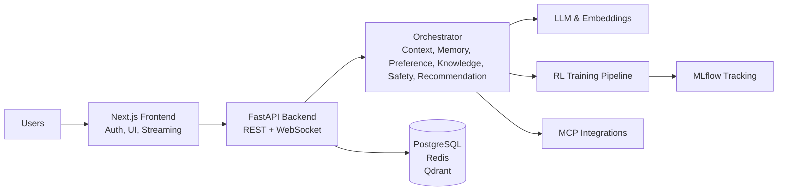

# AURA — Autonomous User Recommendation & Reasoning Architecture

> A multi-agent reinforcement learning recommendation platform powered by LLMs, MCP, long-term memory, and continuous learning.
>
> Shifts from a prediction engine ("What should I recommend?") to an autonomous decision-making platform ("Why, when, how confident, and how to continuously improve?").

**Version 0.2.0** — real services, real RL, real LLM, real auth, streaming orchestration.

---

## What's new in 0.2.0

The MVP has been transformed from a mock demo into a production-grade system. Every layer now talks to real services, with graceful fallback to in-process mocks when services are unavailable.

| Layer | Before (v0.1) | After (v0.2) |
|-------|---------------|--------------|
| **Data** | in-memory dicts | PostgreSQL (asyncpg) + Redis (redis.asyncio) + Qdrant (qdrant-client) |
| **LLM** | hardcoded strings | Groq (Llama-3.3-70B, OpenAI-compatible) → HuggingFace → template fallback |
| **Embeddings** | hash-based pseudo-embeddings | `sentence-transformers` BGE-small-en-v1.5 (384-dim, CPU) |
| **RL** | numpy PPO mock | PyTorch + stable-baselines3 PPO + MLflow tracking + custom Gymnasium env |
| **MCP** | all mocks | real Spotify + Google Calendar + GitHub via OAuth2; mock fallback for others |
| **Auth** | single demo user | NextAuth.js (GitHub/Spotify/Credentials) ↔ FastAPI JWT bridge, multi-user |
| **Orchestration** | blocking POST returns full result | streaming: POST returns immediately, per-agent progress events flow over WebSocket |
| **Frontend** | polled every 8s | live agent-step animation via WebSocket, OAuth connections page, sign-in flow |

---

## Architecture



---

## Quick start

### 1. Backend (Python 3.12 + FastAPI)

```bash
cd aura-backend

# Copy env template and fill in real values
cp .env.example .env
#   - Set GROQ_API_KEY (free at https://console.groq.com/keys)
#   - Set NEXTAUTH_SECRET to a long random string
#   - Set OAuth client_id/secret for Spotify/Google/GitHub (optional)

# Install deps
pip install -r requirements.txt

# Start real services (Postgres + Redis + Qdrant + MLflow)
docker compose up -d

# Run DB migrations (auto-applied by docker-compose entrypoint)
# migrations/001_init.sql creates all tables

# Start the backend
uvicorn app.main:app --host 0.0.0.0 --port 8000 --reload
```

The backend will gracefully degrade if Docker services aren't running — you'll see warnings like `postgres: unavailable — falling back to in-memory`, but the platform stays fully functional.

### 2. Frontend (Next.js 16)

```bash
# From the repo root
cp .env.example .env.local
#   - Set NEXTAUTH_SECRET (same as backend)
#   - Set NEXTAUTH_URL=http://localhost:3000
#   - Set GITHUB_CLIENT_ID / GITHUB_CLIENT_SECRET (optional)
#   - Set SPOTIFY_CLIENT_ID / SPOTIFY_CLIENT_SECRET (optional)

bun install
bun run dev
```

Open http://localhost:3000 — you'll see the sign-in page. Click "Continue as AURA Demo User" for instant access, or sign in with GitHub/Spotify if you've configured OAuth.

---

## What you can do

### Orchestrate (streaming!)
Click **Run Orchestration**. The backend kicks off the 8-agent loop and streams per-agent progress over WebSocket:
- Each agent node in the network graph turns **amber** while running
- Turns **green** when complete, with its latency in ms
- Final recommendations + LLM-generated explanations appear at the bottom

### Stream user actions → RL pipeline
Click any action button on a recommendation (👍 like, 🛒 purchase, ⏭ skip). The action flows through the event bus → reward generator → experience buffer → PPO policy trainer. Watch `samples_seen` and `policy_version` update in real time.

### Train the policy
Click **Train Policy** in the RL panel. A real PyTorch PPO update step runs:
- Stable-baselines3 PPO.learn() on the AuraRecEnv
- Policy version bumps (e.g. `ppo-v0.0.5 → ppo-v0.0.6`)
- If MLflow is up, params + metrics + artifact are logged
- Policy zip saved to `/tmp/aura-policies/`

### Connect real MCP tools
Go to **Settings → Connected Accounts**:
- Connect Spotify → `/api/mcp/call spotify/now_playing` returns your real currently-playing track
- Connect Google Calendar → Context Agent pulls your real next event
- Connect GitHub → `/api/mcp/call github/recent_activity` returns your real repos + PRs

### Inspect any agent
The dashboard exposes per-agent REST endpoints:
- `GET /api/preference` — preference profile
- `GET /api/context` — current context snapshot
- `GET /api/memory` — long-term memory records
- `GET /api/knowledge?q=PPO` — RAG over knowledge graph + docs (LLM-grounded answer)
- `GET /api/agents/status` — per-agent latency + status

---

## Configuration reference

All config lives in `aura-backend/.env` (see `.env.example`).

### LLM providers (priority order)

| Provider | When to use | How to enable |
|----------|-------------|---------------|
| **Groq** (default) | Free tier, fast, Llama-3.3-70B | `LLM_PROVIDER=groq` + `GROQ_API_KEY=...` |
| **HuggingFace** | Free tier, many models | `LLM_PROVIDER=hf` + `HF_API_TOKEN=...` |
| **Template** | No API key required | `LLM_PROVIDER=template` (or fallthrough) |

### Embeddings

| Model | Size | Dim | Use case |
|-------|------|-----|----------|
| `BAAI/bge-small-en-v1.5` (default) | ~130MB | 384 | CPU-friendly dev |
| `BAAI/bge-m3` | ~2.3GB | 1024 | Production, multilingual |

If HuggingFace is unreachable, falls back to deterministic hash pseudo-embeddings (same shape, lower quality).

### RL

| Setting | Default | Description |
|---------|---------|-------------|
| `RL_ALGORITHM` | `ppo` | Currently only PPO is wired (DQN/bandits are stubs) |
| `RL_STATE_DIM` | 32 | Observation vector size |
| `RL_ACTION_DIM` | 32 | Discrete action space size |
| `RL_TRAIN_INTERVAL_STEPS` | 10 | Auto-train every N ingested actions |
| `RL_MLFLOW_EXPERIMENT` | `aura-rl-ppo` | MLflow experiment name |

### Feature flags (graceful degradation)

```bash
USE_REAL_POSTGRES=true     # false → in-memory mock
USE_REAL_REDIS=true        # false → in-process dict
USE_REAL_QDRANT=true       # false → in-memory cosine search
USE_REAL_LLM=true          # false → template provider only
USE_REAL_RL=true           # false → numpy PPO mock
USE_REAL_MCP=true          # false → all mock handlers
```

---

## API reference

### REST

| Method | Path | Description |
|--------|------|-------------|
| `GET`  | `/api/health` | Liveness probe |
| `GET`  | `/api/info` | Version, LLM provider, RL backend, agent list |
| `POST` | `/api/orchestrate` | Kick off streaming orchestration (returns `request_id` immediately) |
| `GET`  | `/api/orchestrate/last` | Fetch the last completed result |
| `GET`  | `/api/agents/status` | Per-agent status array |
| `GET`  | `/api/preference` | Preference profile for current user |
| `GET`  | `/api/context` | Current context snapshot |
| `GET`  | `/api/memory` | Long-term memory records |
| `GET`  | `/api/knowledge?q=...` | RAG query (LLM-grounded answer) |
| `GET`  | `/api/mcp/tools` | List MCP tools + per-user connection status |
| `POST` | `/api/mcp/call` | Invoke an MCP tool (`{tool, method, args}`) |
| `GET`  | `/api/oauth/{provider}/login` | Start OAuth flow → returns `auth_url` |
| `GET`  | `/api/oauth/callback/{provider}` | OAuth callback (Google Calendar only) |
| `GET`  | `/api/oauth/status` | Per-provider `{configured, connected}` map |
| `DELETE` | `/api/oauth/{provider}` | Disconnect a provider |
| `GET`  | `/api/rl/metrics` | RL metrics (cumulative reward, policy version, etc.) |
| `POST` | `/api/rl/train` | Run a PPO training step |
| `POST` | `/api/rl/action` | Stream a user action (`{item_id, action}`) |
| `GET`  | `/api/rl/history` | Recent actions + policy updates |
| `GET`  | `/api/metrics` | Dashboard metrics (rec / business / RL) |
| `GET`  | `/api/data/summary` | Data layer health + counts |

### WebSocket

`ws://localhost:8000/api/ws`

Message types pushed by the server:

| `type` | When | Payload |
|--------|------|---------|
| `hello` | on connect | `{service, ts}` |
| `agent_start` | before each agent runs | `{agent, request_id, input_summary, ts}` |
| `agent_step` | after each agent completes | `{agent, request_id, duration_ms, output_summary, artifacts, ts}` |
| `orchestration_complete` | full loop done | `{request_id, result, ts}` |
| `rl_update` | RL metrics changed | `{rl: RLMetrics, ts}` |
| `tick` | every 3s liveness | `{rl, agents, ts}` |

---

## Project structure

```
aura-backend/
├── docker-compose.yml          # Postgres + Redis + Qdrant + MLflow
├── migrations/001_init.sql     # Initial schema
├── requirements.txt
├── .env.example
└── app/
    ├── main.py                 # FastAPI app + lifespan
    ├── config.py               # Pydantic settings
    ├── api/routes.py           # REST + WebSocket routes
    ├── auth/
    │   └── dependencies.py     # get_current_user (JWT validation)
    ├── agents/
    │   ├── orchestrator.py     # 8-agent loop + WS event emission
    │   ├── context.py          # MCP-backed context snapshot
    │   ├── preference.py       # Async Postgres + BGE embeddings
    │   ├── memory.py           # Qdrant + Postgres long-term memory
    │   ├── knowledge.py        # RAG (KG + dense) + LLM synthesis
    │   ├── recommendation.py   # CF + Neural-CF + GNN + LLM rank (mock rankers)
    │   ├── explanation.py      # LLM-backed why/why-not (JSON mode)
    │   └── safety.py           # Bias / unsafe / hallucination checks
    ├── data_layer/
    │   ├── __init__.py         # Hybrid facade (real vs mock auto-routing)
    │   ├── store.py            # In-memory mock classes
    │   ├── postgres.py         # asyncpg pool
    │   ├── redis_client.py     # redis.asyncio + fallback
    │   └── qdrant.py           # qdrant-client async
    ├── events/
    │   ├── bus.py              # In-memory event bus (Kafka-style)
    │   └── ws_hub.py           # WebSocket broadcast hub
    ├── llm/
    │   ├── client.py           # Groq → HF → template cascade
    │   └── embeddings.py       # sentence-transformers BGE
    ├── mcp_tools/
    │   ├── registry.py         # Hybrid real/mock handler dispatch
    │   ├── oauth.py            # OAuth2 flow + token storage
    │   └── handlers/           # Real Spotify / GitHub / Google Calendar handlers
    ├── models/schemas.py       # Pydantic models
    └── rl/
        ├── pipeline.py         # Hybrid facade (torch vs numpy)
        ├── torch_pipeline.py   # stable-baselines3 PPO + MLflow
        └── env.py              # AuraRecEnv (custom Gymnasium env)

src/                            # Next.js 16 frontend
├── app/
│   ├── page.tsx                # Dashboard (streaming-aware)
│   ├── layout.tsx              # SessionProvider wrapper
│   ├── auth/signin/page.tsx    # NextAuth sign-in
│   ├── settings/page.tsx       # OAuth connections
│   └── api/auth/[...nextauth]/ # NextAuth handler
├── components/
│   ├── aura/                   # Dashboard widgets (Header, AgentNetwork, etc.)
│   ├── auth/                   # UserMenu, Providers
│   └── ui/                     # shadcn/ui primitives
├── hooks/
│   └── use-streaming-orchestration.ts   # Live per-agent progress hook
└── lib/aura/
    ├── api.ts                  # Fetch + WS client (JWT-aware)
    └── types.ts                # TypeScript types mirroring backend schemas
```

---

## Production notes

- **Scaling:** WebSocket hub supports Redis pub/sub fan-out for multi-worker deployments.
- **Auth:** Set `ENVIRONMENT=prod` to require JWT on all endpoints (no demo user fallback).
- **RL training:** For real production scale, move PPO training to a separate worker process consuming from Kafka, not the request path.
- **Embeddings:** Switch from `bge-small-en-v1.5` to `bge-m3` for multilingual + higher dim. Pre-download the model in your Docker image to avoid cold-start latency.
- **Observability:** `prometheus-client` is in requirements — wire `/metrics` endpoint to expose Prometheus metrics.

---

## License

MIT
